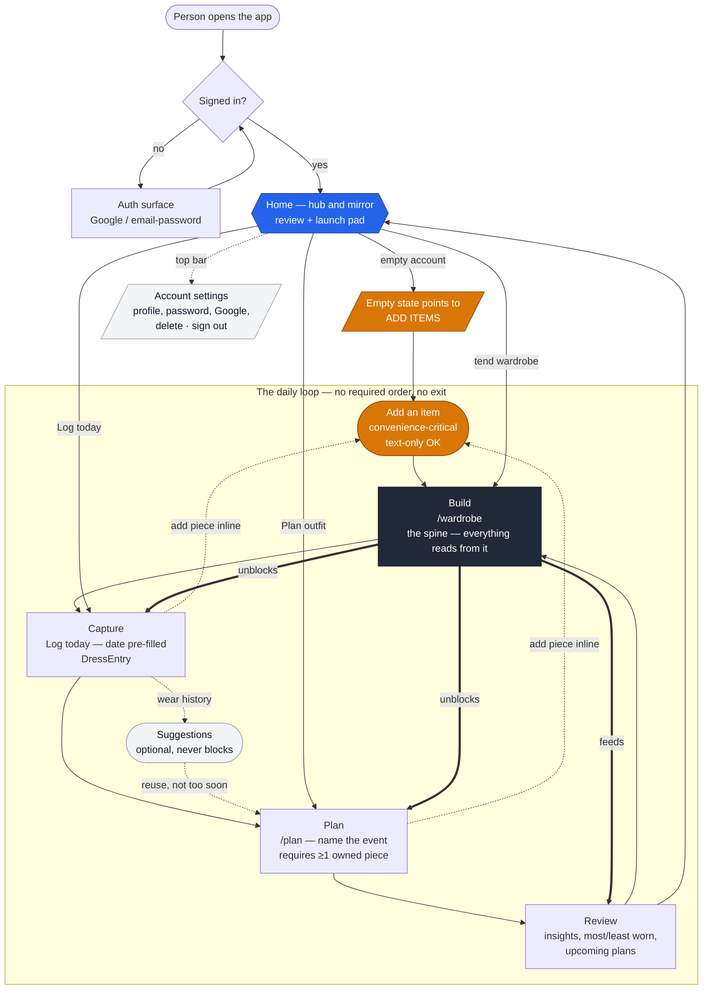

# Application Userflow — Diagram

The visual companion to [`app-journey.md`](./app-journey.md). It shows the **whole-app journey**:
the gate (auth), the **cold start** that forces a new person to stock their wardrobe first, and the
**repeating loop** — Build → Capture → Plan → Review → Build — with the inline hand-offs that let a
person add an item from wherever they notice a gap.

Read the edges, not just the boxes: the connections between motions are the payload.

## The journey

## How to read it

- **Gate (top).** Every surface sits behind sign-in; a signed-in person lands on **Home**. Detail:
  [`auth-and-accounts.md`](./auth-and-accounts.md).
- **Cold start (orange path).** A new, empty account is steered straight into **Add an item** —
  because nothing downstream works until the wardrobe has pieces.
- **The loop (center).** **Build → Capture → Plan → Review → Build.** It is a ring, not a funnel:
  there is no exit, and no lap has to use all four motions.
- **Build is the spine (dark).** The bold `unblocks` / `feeds` edges show that planning, logging, and
  insights all depend on owned pieces. A plan needs at least one (`OutfitPlanItemOwnershipError`).
- **Add an item is everywhere (orange).** Dotted `add piece inline` edges show it reaching into the
  planner and the daily log, not just the wardrobe — the convenience-critical motion.
- **Home is the hub (blue).** Every lap returns to it (review) and launches from it (*Plan outfit*,
  *Log today*, tend wardrobe).
- **Optional aids (grey, dotted).** Wear history feeds **suggestions** back into planning, but they
  never block. Account settings sits off the loop.

## Notes

- This is a Mermaid `flowchart` so it renders inline anywhere Mermaid is supported (GitHub,
  most markdown previewers) and stays diffable in version control — matching the rest of `docs/`.
- If a presentation-grade visual is ever needed, this same graph can be regenerated in FigJam/Figma
  via the Figma MCP `generate_diagram` tool; the Mermaid source here is the canonical version.
